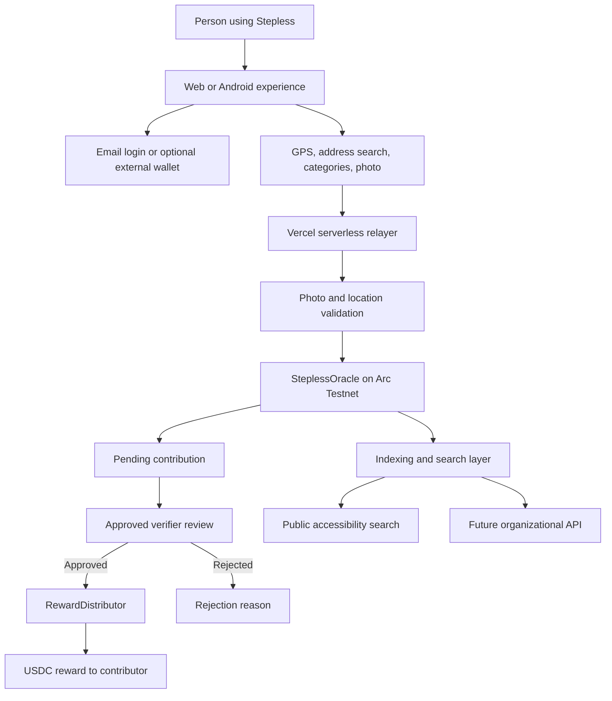

<div align="center">


# Stepless

### Know before you go. Contribute what you find. Improve access for everyone.

**A community-powered accessibility map and verifiable data layer built on Arc Testnet.**

People can discover accessible places before leaving home.  
Contributors document real-world accessibility and earn micro-rewards in USDC after verification.  
Organizations can integrate trusted accessibility data into mobility, travel, mapping, and public-service products.

[](https://arc.network)
[](https://www.circle.com/usdc)
[](#current-status)
[](LICENSE)
[](contracts/src/)

**[Open Stepless](https://www.stepless.lat)** ·
**[Contributor Dashboard](https://www.stepless.lat/dashboard.html)** ·
**[Search Accessible Places](https://www.stepless.lat/buscar.html)**

</div>

---

> **Accessibility information should not depend on chance, goodwill, or outdated databases.**

## The real-world problem

Before visiting a restaurant, school, clinic, hotel, store, or public building, a person may need answers to simple but essential questions:

- Is there a step-free entrance or ramp?
- Is there an accessible restroom?
- Is there an elevator?
- Is there accessible parking?
- Are there tactile paths, Braille signs, or other accessibility resources?
- Is the information recent and trustworthy?

Today, this information is often missing, outdated, fragmented, or locked inside centralized platforms. The result is more than inconvenience: people can travel across a city only to discover that they cannot enter or use a place independently.

## The Stepless solution

Stepless creates a living accessibility map maintained by the community.

A contributor documents a location's accessibility resources, adds visual evidence, and submits the information. During the Arc Testnet phase, screenshots and demonstration images may be used to test the complete product flow. Once Stepless moves toward mainnet and real-value rewards, stricter image authenticity and location-verification controls will be required before a contribution becomes trusted data.

The blockchain operates underneath the experience. Users should not need to understand gas, hashes, bridges, or smart contracts to help improve accessibility.

### One contribution can change a real decision

A verified ramp, elevator, restroom, parking space, or access warning can help someone decide:

- whether they can visit a place independently;
- which entrance they should use;
- whether they need assistance;
- whether they should choose another destination.

---

## Who Stepless serves

### People searching for accessible places

Search locations before leaving home and understand the accessibility resources available at each destination.

### Community contributors

Map new locations, report changes, upload evidence, build reputation, and receive rewards after approved contributions.

### Verifiers and accessibility organizations

Review submissions, improve data quality, and help establish trusted local accessibility networks.

### Cities, travel, mobility, and mapping platforms

Use accessibility data to improve routing, tourism, urban planning, public services, and inclusive digital products.

---

## Product experience

Stepless is designed around the shortest useful path:

```text
Search a place
      ↓
See accessibility information
      ↓
Notice missing or outdated data
      ↓
Enter with email
      ↓
Take a photo and confirm the location
      ↓
Submit for verification
      ↓
Receive USDC after approval
```

### Web3 without Web3 friction

Stepless supports email-based onboarding with an embedded wallet. A contributor does not need to install MetaMask or understand seed phrases to begin.

The current architecture also uses a relayer to submit standard app transactions and sponsor gas on Arc Testnet. The wallet is primarily the user's destination for rewards.

MetaMask remains available as an advanced option.

### Withdrawing your rewards

Receiving USDC is only half of the experience — contributors must also be able to use it. Stepless treats the "last mile" as a product responsibility:

1. **Send from the app.** The dashboard will include a simple "Send USDC" flow (destination address + amount). Because gas on Arc is paid in USDC, a contributor's reward balance is always self-sufficient for sending — no extra gas token required.
2. **Bridge to other networks.** For moving funds to an exchange, Arc provides the official [App Kit Bridge](https://docs.arc.io/app-kit/bridge) (CCTP-based) to move USDC between Arc and other supported chains. Embedding this flow in-app is planned before mainnet.
3. **Plain-language guide.** A "How to use your rewards" page explains the options without jargon, so a first-time user never feels their balance is stuck.
4. **Your wallet is yours.** The embedded wallet's key can be exported through the wallet provider, so an advanced user can import the same account into MetaMask or any standard wallet at any time.

During testnet, rewards have no real value, so items 1 and 3 are the demonstration targets; the embedded bridge is pre-mainnet roadmap work.

### What happens if you lose access to your email

Testnet accounts are tied to the login email, and account-recovery flows are still in progress (see [Pilot work in progress](#pilot-work-in-progress)). Because no real-value rewards are at stake during testnet, this is a lower-risk phase to identify and fix recovery gaps before mainnet. Before mainnet, Stepless will publish a clear, documented recovery process — this is a public commitment, not an assumption users should have to make on their own.

---

## What can be mapped

Current accessibility categories include:

- step-free entrance and ramps;
- elevators;
- accessible restrooms;
- accessible parking;
- signage, Braille, and tactile paths;
- other accessibility resources described by the contributor.

Each location can include geographic coordinates, categories, supporting evidence, contribution history, and verification status.

---

## Installing the Android test build

The current Android build is distributed as a direct APK, not through the Play Store, because Stepless is still in the Arc Testnet pilot phase.

This means Android will show a warning like **"install blocked"** or **"unknown sources"** the first time you open the file. This is expected for any pre-release APK — it is not specific to Stepless and does not mean the app is unsafe. It happens because the app was not downloaded from an app store, not because of what the app does.

To install:

1. Download the APK from the link shared by the Stepless team.
2. When Android blocks the install, open **Settings → Install unknown apps**, select the app you used to download the file (e.g., your browser), and allow installs from that source.
3. Return to the download and tap install.
4. You can revert that permission afterward if you prefer.

This flow is temporary. Once Stepless reaches mainnet, distribution will move to the Play Store and/or App Store, and this manual step will no longer be necessary.

---

## Trust before scale

Accessibility data is only useful when people can trust it.

Stepless is building a layered validation model:

### Location evidence

- GPS or address-based location selection;
- interactive map for precise positioning;
- screenshots or demonstration images accepted during testnet testing;
- optional EXIF and location checks where available;
- testnet validation focused on demonstrating the complete submission flow;
- stricter image authenticity, freshness, duplication, and location checks planned for mainnet.

### Contribution review

- contributions enter a pending state;
- approved verifiers accept or reject submissions;
- contributors cannot verify their own submissions;
- verification and rejection outcomes are recorded;
- approved contributions can trigger a reward payment.

### Transparent records

The Arc Testnet contracts record locations, contributions, contributors, verification results, and reward-related events. Users and developers can inspect the on-chain activity through ArcScan.

### Testnet vs. mainnet: what changes

| Area | Testnet (now) | Mainnet (planned) |
|---|---|---|
| **Evidence** | Screenshots or demonstration images accepted | Real-time capture required; stricter authenticity checks |
| **Location proof** | Optional EXIF/GPS checks | Mandatory location-consistency validation |
| **Duplication / fraud** | Not enforced | Duplicate and manipulated-image detection |
| **Rewards** | Test USDC, no real value | Real-value USDC reward program |
| **Verifiers** | Permissioned, admin-selected | Path toward broader, accountable verifier network |
| **Storage** | Standard off-chain storage | Production evidence storage (e.g., IPFS or equivalent) |
| **Claim on data** | Demonstration of the flow only | Treated as trusted real-world accessibility data |

### Honest MVP model

The current Arc Testnet version is a functional demonstration environment. Screenshots and other test images may be used to demonstrate registration, verification, and reward flows without claiming that the image proves a real-world accessibility condition.

The testnet also uses a managed relayer, an administrator, and permissioned verifiers. This controlled environment is intended to validate the product experience, contract interactions, and reward workflow.

Before mainnet and real-value rewards, Stepless plans to introduce stricter controls for image authenticity, location consistency, freshness, duplication, contributor abuse, and verifier accountability.

Decentralized verifier selection and broader governance belong to a later protocol phase. Stepless does not claim that the current MVP is fully decentralized or production-ready.

---

## Why Arc

Stepless uses Arc because the network's design can turn small accessibility contributions into practical, programmable economic actions.

| Arc capability | Benefit for Stepless |
|---|---|
| **USDC-native gas** | The app can sponsor transactions and reward contributors without exposing them to a volatile gas token. |
| **Fast settlement** | Contributors can see submissions and reward transactions confirmed quickly. |
| **EVM compatibility** | Stepless can use Solidity, viem, familiar wallet infrastructure, and existing developer tooling. |
| **Programmable USDC** | Small, transparent contribution rewards become technically practical. |
| **HTTP 402 direction** | Accessibility data can become a paid machine-readable service for apps and organizations. |
| **Circle ecosystem** | Stepless can grow around trusted stablecoin infrastructure instead of creating a speculative token. |

Stepless does **not** need its own token. The product is built around useful data, real-world participation, and USDC-based incentives.

### The business model this makes possible

Most accessibility data today is either free and unmaintained, or locked inside a paid platform nobody trusts. Arc's programmable USDC and the HTTP 402 direction let Stepless pay individual contributors in small, transparent amounts for verified data, while charging organizations for machine-readable access to that same data — without a speculative token and without asking contributors to hold crypto. That two-sided model (free for people, paid for organizations) is only practical because settlement is fast and cheap enough to make micro-rewards real. See [Sustainable business model](#sustainable-business-model).

---

## Live demonstration flow

A presentation of Stepless should show one complete user journey rather than isolated screens.

### 1. Search

Search for a destination and inspect its known accessibility resources.

### 2. Identify missing information

Show a place with incomplete or outdated accessibility data.

### 3. Enter with email

Use the email onboarding flow. The embedded wallet is created under the hood.

### 4. Map the location

Use GPS or address search, adjust the point on the map, choose accessibility categories, and add a screenshot or demonstration image. During testnet, the goal is to show that the full contribution flow works.

### 5. Submit

The relayer processes the request and registers the contribution on Arc Testnet while sponsoring gas. Testnet evidence is demonstrative and should not be treated as verified proof of a real-world accessibility condition.

### 6. Verify

An approved verifier reviews the contribution and accepts or rejects it.

### 7. Reward

After approval, USDC is paid to the contributor's wallet and the transaction can be inspected on ArcScan.

> **Core demo message:** a person can improve accessibility data in minutes without needing to understand blockchain.

---

## Current status

### Working on Arc Testnet

- [x] Public Stepless web experience
- [x] Accessible-place search interface
- [x] Contributor dashboard
- [x] Portuguese, English, and Spanish interfaces
- [x] Email onboarding with embedded wallet support
- [x] MetaMask as an optional advanced login
- [x] GPS and address-based location selection
- [x] Interactive map marker
- [x] Image upload flow for screenshots and test evidence
- [x] Optional EXIF and location-validation components for testing
- [x] Gas-sponsored relayer architecture
- [x] Location and contribution contracts deployed
- [x] Verification and reward payment workflow
- [x] ArcScan-verifiable testnet transactions
- [x] Android test build available (direct APK — see [Installing the Android test build](#installing-the-android-test-build))
- [x] x402 protocol contract deployed

### Pilot work in progress

- [ ] Fund the reward treasury
- [ ] Onboard the first trusted verifiers
- [ ] Map the first 100 accessible locations
- [ ] Complete the public contribution and reward history
- [ ] Deploy and stabilize the Goldsky indexing layer
- [ ] Run structured tests with people with disabilities
- [ ] Establish the first local accessibility partner
- [ ] Publish a clear account recovery and support process

### Not yet production-ready

- Arc mainnet deployment;
- real-value public reward campaign;
- mandatory image-authenticity verification;
- strict proof that evidence was captured at the submitted location;
- duplicate and manipulated-image detection;
- decentralized verifier election;
- production IPFS or equivalent evidence storage;
- large-scale anti-Sybil protections;
- institutional API service-level guarantees;
- DAO governance;
- Play Store / App Store distribution (current Android build is a direct APK).

USDC shown on testnet does not represent a production reward program.

---

## First pilot

The first measurable Stepless mission is intentionally focused:

### Map 100 accessible locations in one pilot area

The pilot should answer five questions:

1. Can a non-technical contributor complete the testnet flow?
2. Can the registration, verification, and reward cycle be demonstrated reliably?
3. Which accessibility categories are most useful?
4. Which image-authenticity controls will be required before mainnet?
5. Can the pilot evolve from demonstration data into trusted real-world accessibility data?

Success should be measured by:

- verified locations;
- approved and rejected contributions;
- time required to submit;
- time required to verify;
- repeat contributors;
- data corrections;
- searches performed;
- feedback from people with disabilities.

Stepless will expand city by city only after the contribution and verification loop is reliable.

---

## Sustainable business model

The long-term model keeps essential access free for individuals while charging organizations that consume or commission accessibility data at scale.

### Free for people and contributors

- search accessible places;
- inspect accessibility resources;
- submit and update information;
- participate in community verification;
- receive eligible contribution rewards.

### Paid services for organizations

Potential revenue streams include:

- accessibility-data API plans;
- high-volume and regional data access;
- municipal and enterprise dashboards;
- data-quality and freshness reports;
- accessibility monitoring and change alerts;
- sponsored mapping campaigns;
- tourism and mobility integrations;
- compliance and inclusion reporting;
- custom datasets for cities, universities, hotels, retailers, and transport operators.

### Reward funding

Contribution rewards can be funded through a combination of:

- Arc and ecosystem grants;
- accessibility and public-interest grants;
- sponsored mapping campaigns;
- municipal or institutional pilots;
- corporate inclusion and ESG programs;
- API and dashboard revenue.

The objective is not to pay indefinitely for unverified volume. It is to create a sustainable market for useful, recent, and trustworthy accessibility data.

---

## System architecture



### Current implementation

```text
User
  │
  ▼
Stepless frontend
  │
  ├── Email onboarding / embedded wallet
  ├── GPS and address search
  ├── Interactive map
  └── Photo evidence
  │
  ▼
Vercel serverless APIs
  │
  ├── Rate limiting
  ├── EXIF and distance validation
  ├── Off-chain display metadata
  └── Sponsored Arc transaction
  │
  ▼
SteplessOracle
  │
  ├── Location registry
  ├── Contribution tracking
  └── Verification records
  │
  ▼
RewardDistributor
  │
  └── USDC reward settlement
  │
  ▼
Indexing and data services
```

---

## Deployed contracts

**Network:** Arc Testnet  
**Chain ID:** `5042002`

| Contract | Address | Purpose |
|---|---|---|
| **SteplessOracle** | [`0x2Ac87a4E49D59900295999B1A44930B912F65F48`](https://testnet.arcscan.app/address/0x2Ac87a4E49D59900295999B1A44930B912F65F48) | Accessible-location registry and contribution lifecycle |
| **RewardDistributor** | [`0x4959d0BB848Af5437F249E8516914e0e9353584b`](https://testnet.arcscan.app/address/0x4959d0BB848Af5437F249E8516914e0e9353584b) | USDC treasury and reward settlement |
| **X402API** | [`0x0D318864C80eCe8d28800a750bdA06b6E52ffCc9`](https://testnet.arcscan.app/address/0x0D318864C80eCe8d28800a750bdA06b6E52ffCc9) | Early protocol layer for paid accessibility-data access |

Example `registerLocation` activity has been confirmed on Arc Testnet.

---

## Smart contracts

### `SteplessOracle.sol`

The on-chain accessibility registry.

Main responsibilities:

- register accessible locations;
- associate contributors with submissions;
- record supporting-data hashes;
- track pending, approved, and rejected contributions;
- prevent self-verification;
- emit indexable events;
- connect verified contributions to the reward system.

### `RewardDistributor.sol`

The USDC reward engine.

Main responsibilities:

- hold the testnet reward treasury;
- register and manage verifiers;
- apply reward tiers;
- prevent duplicate claims;
- pay approved contributors.

### `X402API.sol`

The early paid-data protocol layer.

The goal is to let approved applications pay for machine-readable accessibility data using HTTP 402 and USDC. The contract is deployed, while the complete production API and commercial service remain roadmap work.

---

## Repository structure

```text
Stepless/
├── contracts/
│   └── src/
│       ├── SteplessOracle.sol
│       ├── RewardDistributor.sol
│       └── X402API.sol
├── frontend/
│   ├── index.html
│   ├── buscar.html
│   ├── dashboard.html
│   ├── dashboard.js
│   ├── dynamic-wallet.js
│   ├── arc-config.js
│   └── styles.css
├── api/
│   ├── relay.js
│   ├── verify.js
│   ├── setup.js
│   └── _stepless.js
├── subgraph/
│   ├── schema.graphql
│   └── subgraph.yaml
├── docs/
│   └── mascot.svg
└── README.md
```

---

## Product principles

### Real-world value first

Every technical decision must improve accessibility discovery, contribution quality, trust, or sustainability.

### Hide infrastructure complexity

People should interact with places, photos, categories, and rewards—not RPCs, contract methods, or hexadecimal identifiers.

### Accessibility includes the product itself

The interface should support keyboard navigation, semantic HTML, screen readers, readable contrast, clear feedback, and simple language.

### Demonstration first, trusted data next

The testnet proves that the complete product flow works. Mainnet must add stronger image and location authentication before Stepless treats submissions as trusted real-world accessibility data.

### No speculative token

Stepless uses USDC incentives and does not require a proprietary token to manufacture demand.

### Transparent progress

Working testnet features, prototypes, and future roadmap items must be clearly separated.

---

## Roadmap

### Foundation — completed

- Arc Testnet contract deployments;
- gas-sponsored relayer;
- contributor dashboard;
- accessibility search experience;
- embedded email wallet;
- GPS and photo validation flow;
- verification and reward architecture.

### Community pilot — current priority

- treasury funding;
- first verifier group;
- first accessibility partner;
- 100 verified locations;
- usability testing with the target community;
- public metrics and reward history.

### Product maturity

- stronger recovery and support flows;
- production evidence storage;
- improved fraud and Sybil resistance;
- mobile distribution through trusted channels (Play Store / App Store, replacing the direct APK);
- organization dashboards;
- stable indexing and analytics.

### Data network

- production x402 accessibility API;
- paid institutional integrations;
- multi-city expansion;
- sponsored mapping campaigns;
- partner-operated verification networks.

### Protocol evolution

- decentralized verifier selection;
- transparent dispute resolution;
- community governance;
- Arc mainnet deployment when the network, contracts, treasury, and product are ready.

---

## Risks and open questions

Stepless is an active testnet project. Important questions still being tested include:

- how to verify accessibility consistently across different needs;
- how to protect contributor privacy while maintaining useful evidence;
- how to authenticate real-world images before mainnet;
- how to prevent manipulated, fraudulent, or duplicated submissions;
- how to handle disputed or outdated information;
- how to make account recovery safe and simple;
- how to fund rewards sustainably;
- how to prevent reward farming and Sybil attacks;
- how to recruit qualified verifiers;
- how to comply with local privacy and data regulations;
- how to prevent blockchain terminology from becoming an accessibility barrier.

These are product responsibilities, not details to hide.

---

## Contributing

Stepless welcomes contributions from:

- people with disabilities and accessibility advocates;
- UX and accessibility specialists;
- Arc and Solidity developers;
- security reviewers;
- mapping and geospatial engineers;
- municipalities and public-interest organizations;
- travel, mobility, and urban-planning platforms.

Before opening a pull request, please explain:

1. the real user problem being addressed;
2. how the change improves accessibility or data trust;
3. whether it affects contracts, rewards, privacy, or verification;
4. how the change was tested.

---

## Presentation summary

> **Stepless helps people know whether they can access a place before they leave home. The community keeps the information current, contributors can receive USDC after verification, and Arc provides the programmable settlement and verifiable data layer underneath the experience.**

### The three messages to remember

1. **Know before you go.**
2. **Contribute what you find.**
3. **Improve access for everyone.**

---

## Links

| Resource | Link |
|---|---|
| Live application | [stepless.lat](https://www.stepless.lat) |
| GitHub repository | [github.com/Acarlosr/Stepless](https://github.com/Acarlosr/Stepless) |
| Arc Network | [arc.network](https://arc.network) |
| Arc Testnet explorer | [testnet.arcscan.app](https://testnet.arcscan.app) |
| Circle developer resources | [developers.circle.com](https://developers.circle.com) |

---

## License

Stepless is released under the [MIT License](LICENSE).

---

<div align="center">

### Accessibility should not depend on goodwill.

**It should be discoverable, verifiable, and rewarded.**

Built in Brazil for a more accessible world.

</div>
